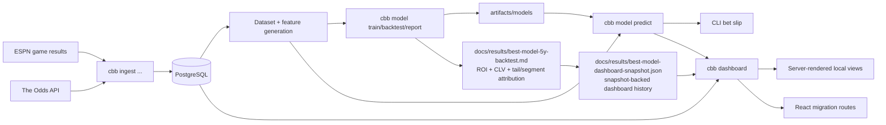

# Architecture

Canonical links:

- [Repository README](../README.md)
- [Model Documentation](model.md)
- [Current Best-Model Report](results/best-model-5y-backtest.md)

This document covers the durable engineering shape of the system. Current tuned
model settings and seasonal bankroll results live in the generated report, not
in the architecture doc.

## System Overview

This repository is a local-first data and modeling system for NCAA men's
basketball betting workflows. It has four major runtime layers:

- upstream data providers: ESPN for game results and The Odds API for current
  and historical betting markets
- local storage: PostgreSQL as the system of record
- local compute: a Python CLI that ingests data, trains models, runs backtests,
  produces predictions, can run a looping local live refresh cycle, and can
  launch a local dashboard UI
- local infrastructure: a `k3d` Kubernetes cluster that runs PostgreSQL and the
  chart's supporting services

Conceptually, the data flow is:

`ESPN / Odds API -> ingest -> PostgreSQL -> feature generation -> training or prediction -> artifacts / report / dashboard`

## Major Components

- Data ingestion: `src/cbb/ingest/` loads ESPN results, current odds, and
  historical closing odds, and now also imports captured official NCAA
  availability reports plus wrapped free-source conference / NCAA archive
  captures into the local shadow-data schema.
- Database layer: `src/cbb/db.py` owns engine creation, schema initialization,
  and the high-level database workflows exposed by the CLI.
- Feature computation: `src/cbb/modeling/dataset.py`,
  `src/cbb/modeling/features.py`, and `src/cbb/modeling/ratings.py` convert
  stored games and odds snapshots into sequential training and prediction
  examples.
- Model training pipeline: `src/cbb/modeling/train.py` fits artifacts and saves
  them under `artifacts/models/`.
- Backtesting and policy: `src/cbb/modeling/backtest.py` and
  `src/cbb/modeling/policy.py` simulate walk-forward staking and apply bet
  selection thresholds.
- Prediction engine: `src/cbb/modeling/infer.py` loads artifacts, scores the
  live slate, and formats the ranked recommendations returned by the CLI.
- Report generator: `src/cbb/modeling/report.py` runs the canonical five-
  season walk-forward summary and now also aggregates spread tail and segment
  attribution for the qualified-bet set.
- Dashboard snapshot: `src/cbb/dashboard/snapshot.py` writes and validates the
  canonical dashboard history payload stored at
  `docs/results/best-model-dashboard-snapshot.json`.
- Dashboard middleware: `src/cbb/dashboard/` owns snapshot/report orchestration,
  typed dashboard payloads, prediction refresh, and in-process caching behind a
  frontend-facing service boundary.
- Dashboard UI: `src/cbb/ui/` is a lightweight WSGI shell that serves the
  React client plus the JSON endpoints it reads. It still talks to the
  dashboard middleware rather than importing modeling or database code paths
  directly.
- CLI interface: `src/cbb/cli.py` is the operational entry point for database,
  ingest, train, backtest, predict, dashboard, audit, and backup commands.
- Agent workflow: `src/cbb/agent.py` owns the one-iteration recent-ESPN plus
  current-odds refresh used by the looping `cbb agent` command for local live
  operations. It derives its ESPN catch-up window from the latest stored
  ingest checkpoint, still refreshes a bounded recent window for late score
  and status corrections, reuses the stored canonical team catalog when the
  local database is already seeded, and then runs one best-path
  upcoming-board scan before the CLI sleeps for the next iteration. The CLI
  rendering layer can add operator-facing convenience output such as separate
  FanDuel team-page links for each current qualified bet without changing the
  prediction contract itself.
- Manual roadmap worktrees: infra, model, and UX improvement work no longer
  has a built-in supervisor. Operators open dedicated git worktrees and
  terminals per lane, then use the tracked roadmap markdown plus the role
  prompt files under `agents/` as manual guidance.
- Helm chart: `chart/cbb-upsets/` defines the local Kubernetes deployment used
  for PostgreSQL and the chart's supporting service resources.

## Data Storage

PostgreSQL is the primary persistent store.

The main tables are:

- `teams`: canonical Division I team catalog, including conference metadata
- `team_aliases`: provider-specific names mapped back to canonical teams
- `games`: normalized schedule and result rows, including scores, event IDs,
  and stored ESPN venue / neutral-site / postseason metadata
- `odds_snapshots`: current and historical bookmaker snapshots for moneyline,
  spread, and totals markets
- `ingest_checkpoints`: historical game backfill checkpoints
- `historical_odds_checkpoints`: historical odds snapshot checkpoints
- `ncaa_tournament_availability_reports`: stored official availability report
  snapshots and wrapped archive-derived report snapshots with provenance,
  timing, linkage, and raw payloads
- `ncaa_tournament_availability_player_statuses`: normalized player-status rows
  attached to stored official report snapshots

What is persisted:

- canonical team identity and aliases
- historical and upcoming games, including neutral-site, season-type,
  tournament-note, and venue fields when ESPN provides them
- current odds captures
- historical closing-odds captures
- shadow-only official and archive-derived availability report snapshots and
  normalized player statuses
- checkpoint state that makes ingest rerunnable

What is still intentionally missing:

- derived travel distance, altitude, and time-zone features

Those derived travel-oriented fields are not stored in Postgres. The repo now
keeps the audited team home-location catalog as a tracked file at
`data/team_home_locations.csv`, and the modeling/report layer derives neutral-
site travel and timezone metadata from that file plus stored ESPN venue
city/state fields at runtime. The bounded tournament lane also keeps tracked
local bracket specs in
`data/tournaments/`; `cbb model tournament` uses the current field spec for
forward bracket fills, while `cbb model tournament-backtest` replays completed
historical specs instead of trying to infer bracket structure from the stored
game table alone. That tournament wrapper now also trains one transient
common-feature fallback model per invocation so synthetic bracket rows without
usable moneyline prices are not scored by zero-filling the market-heavy
moneyline artifact.

Normal closing-odds backfills use `historical_odds_checkpoints` to skip
snapshot times already attempted for the same market and region filter. Recent
missing-close repair can explicitly bypass that skip layer with
`cbb ingest closing-odds --ignore-checkpoints` while still limiting the run to
games that do not yet have a stored closing line.

What is not stored in Postgres:

- trained model artifacts, which live as JSON files under `artifacts/models/`
- SQL backups, which live under `backups/`
- the tracked home-location catalog, which lives in
  `data/team_home_locations.csv`

## Kubernetes Architecture

Local development uses a `k3d` cluster created by `make k8s-up`.

The Helm chart currently deploys:

- PostgreSQL, enabled through the chart dependency and local values files
- a small NGINX deployment and service included in the chart templates

The important design point is that the main application logic does not run as
an in-cluster service today. Ingest, audit, training, backtesting, prediction,
dashboard serving, backup, and the local agent loop are run as local CLI jobs
from the developer shell. The CLI talks to the cluster-hosted database through
`kubectl port-forward`, typically via the repo's `make db-port-forward`
shortcut.

The current infra expansion work adds one supported CLI image foundation
without changing that default operating model yet. `make cli-image-build`
builds a non-root image with the repo rooted at `/app`, exposes `cbb` as the
container entrypoint, and keeps repo-relative runtime files such as
`sql/schema.sql`, `data/team_home_locations.csv`, and `docs/results/` available
inside the image. That build also carries forward any local
`artifacts/models/*_latest.json` files present at build time so the in-cluster
agent paths can load the same promoted best-path artifacts as the local CLI.
If those local `latest` files are absent, the runtime refresh legs still work
but bet scanning will skip because no trained artifact can load. The image now
uses a numeric non-root UID as well, so Kubernetes can honor
`runAsNonRoot=true` without needing deploy-time patches.
The next runtime slice adds one disabled-by-default chart `runtime`
Deployment that can run the existing looping `cbb agent` path from that image.
That pod remains opt-in, stays singleton by default, imports secret-backed env
through values, and derives `DATABASE_URL` from the chart-managed PostgreSQL
release unless operators explicitly override it.
The next scheduled-runtime slice keeps the same CLI entrypoint but adds an
explicit `cbb agent --run-once` mode so chart-managed jobs can execute one
refresh-and-scan iteration and exit cleanly without inheriting the local loop's
sleep cycle. The chart now renders that as one disabled-by-default CronJob
under `runtime.schedule`, with value-driven schedule/history knobs and a
validation guard that refuses to enable the looping Deployment and CronJob at
the same time.
The next UI-hosting slice now adds one optional always-on dashboard middleware
Deployment behind the existing NGINX service. In that topology, the middleware
runs `cbb dashboard --prediction-source cache` from the same CLI image, the
scheduled runtime job can persist the normalized upcoming-bets snapshot into
Postgres with `--cache-predictions`, and the NGINX pod becomes the stable
frontend entrypoint that proxies browser traffic to the middleware service.
The cache-backed overview and picks routes now also surface those latest cached
recommendations directly, while the performance and settled-history summaries
remain tied to the canonical snapshot/report path.

That means the local development loop is:

1. start the `k3d` cluster
2. optionally build the supported CLI runtime image with `make cli-image-build`
   when you are validating the emerging in-cluster runtime path
3. import that tagged image into the local cluster with `make cli-image-load`
   before enabling `runtime` or `runtime.schedule`
4. bootstrap chart dependencies with `make helm-deps` when a fresh worktree
   does not have them yet
5. validate chart rendering with `make helm-check`
6. deploy the Helm release with `make helm-up`
7. optionally validate or deploy the runtime Deployment with
   `make helm-runtime-deploy-check` or `make helm-runtime-deploy-up`
8. optionally validate or deploy the suspended runtime CronJob with
   `make helm-runtime-cron-check` or `make helm-runtime-cron-up`
9. when the periodic schedule is intentionally ready to go live, validate or
   deploy the unsuspended runtime CronJob with
   `make helm-runtime-cron-live-check` or `make helm-runtime-cron-live-up`
10. optionally validate or deploy the always-on dashboard stack with
    `make helm-dashboard-stack-check` or `make helm-dashboard-stack-up`
11. when the cached UI topology is intentionally ready to start scheduled
    refreshes, validate or deploy the unsuspended dashboard stack with
    `make helm-dashboard-stack-live-check` or
    `make helm-dashboard-stack-live-up`
12. when you want browser access from the host machine through the local k3d
    load balancer, validate or deploy the localhost ingress path with
    `make helm-dashboard-ingress-check` or
    `make helm-dashboard-ingress-up`
13. inspect the release state with `make helm-status`
14. inspect runtime pods, runtime jobs, or recent runtime logs with
    `make runtime-pods`, `make runtime-jobs`, or `make runtime-logs`
15. forward PostgreSQL locally with `make db-port-forward`
16. run CLI jobs from the repo virtualenv

The `make helm-check` and `make helm-up` helpers also bootstrap those locked
chart dependencies automatically when the local worktree is missing them.
`make helm-check` keeps the supported validation path concise, while
`make helm-template` remains the explicit full-render helper for operators who
want the complete manifest. `make helm-up` now reuses that same supported
validation path before it reaches `helm upgrade --install`, and
`make helm-status` gives one explicit release-level inspection helper for the
manual path after deploy. The runtime-specific Helm helpers reuse the same
chart/image-tag variables while injecting the explicit runtime mode overrides
needed for local Deployment and suspended-CronJob rollout work. When a runtime
workload needs secret-backed env such as `ODDS_API_KEY`, operators can now put
`runtime.secretEnv` in an untracked override file under `.codex/local/` and
pass it through `HELM_EXTRA_VALUES` without editing tracked chart values. The
chart renders that map as a runtime-specific Kubernetes `Secret`, while
`runtime.envFromSecretName` remains available for clusters that already manage
the secret separately. The staged and live CronJob helpers stay separate on
purpose: the default CronJob path keeps `runtime.schedule.suspend=true`, while
the live helper pair is the explicit operator action that unsuspends periodic
refresh once image and secret wiring are in place. After rollout, the runtime
inspection helpers reuse the same runtime labels to surface pods, CronJobs/jobs,
and recent logs without forcing operators to reconstruct label selectors or pod
names by hand. When the optional middleware Deployment is enabled, the NGINX
pod stays the public service endpoint while proxying requests to the Python
dashboard middleware, so the frontend and middleware scale independently even
though they still share the same repo-owned dashboard contract. The
dashboard-stack helpers bundle that middleware enablement with the cache-
writing runtime CronJob so operators do not have to hand-assemble the combined
Helm overrides for the always-on UI topology. The localhost-access slice adds
one chart-managed `Ingress` resource as well, so the default local k3d
load-balancer port can route browser traffic from `http://localhost:8080/`
into that same NGINX frontend service.

If operators want lightweight live refresh automation, the intended pattern is
still a local process, but now the CLI owns the loop:

- run `cbb agent --delay-mins 15`
- let each iteration catch up from the last stored ESPN checkpoint, then
  refresh a bounded recent ESPN window plus current odds
- let the same iteration score the current `best` path and print any qualified
  or wait-list bets for upcoming games
- keep this as a local process instead of adding an always-on service or
  controller for local development

For chart-managed scheduled runtime jobs, use `cbb agent --run-once` instead of
the local loop form so the pod does one bounded sync and exits.

Infra, model, and UX improvement work follows the same local-first principle,
but it is now a manual operator workflow:

- create one dedicated git worktree per active lane
- keep one terminal attached to each active worktree
- use the matching roadmap markdown and role prompt files under `agents/`
- run verification, commit, and merge manually
- keep the workflow local-only rather than adding a built-in background
  scheduler or controller

The frontend now uses one canonical route surface instead of carrying the
earlier migration aliases forward. The primary `/`, `/teams`, `/models`,
`/performance`, `/picks`, and `/upcoming` routes all serve the React client
and fetch the existing `/api/dashboard`, `/api/teams`,
`/api/teams/<team_key>`, `/api/models`, `/api/performance`, `/api/picks`, and
`/api/upcoming` payloads from the same WSGI process. The checked-in bundle
under `src/cbb/ui/static/react/` is rebuilt from `frontend/` with
`npm run build` when the React client changes, and the old classic fallback
pages plus `/app` beta aliases are no longer part of the supported frontend.
The landing route is now intentionally day-first: it leads with the cached
card, freshness, and near-term board context before the broader report posture
and season-shape trust checks.

## Training Workflow

The training pipeline is intentionally straightforward:

1. load completed historical games and pregame odds from Postgres
2. rebuild rolling team state chronologically
3. generate side-based feature rows for the target market
4. fit the market model and calibration parameters
   The deployable spread path fits expected margin-versus-line, converts that
   estimate to cover probability with a learned global-plus-bucketed residual
   uncertainty model, and then applies calibration.
5. write the artifact to `artifacts/models/`

For moneyline, the training path can also produce specialized price-band models
that are stored inside the artifact and used later by the dispatcher during
scoring.

## Prediction Workflow

Prediction runs from the same local CLI and uses the stored artifacts plus the
latest database state.

At a high level it does this:

1. load the requested artifact or artifacts from `artifacts/models/`
2. load completed games to rebuild current rolling team state
3. load upcoming games and the latest available odds snapshots
4. generate market-specific prediction examples
5. score those examples with the artifact
6. when the opt-in spread timing layer is enabled, defer early spread bets
   unless the auxiliary close-move model expects favorable line movement
7. apply the active betting policy and bankroll limits, including the current
   deployable five-bet same-day top-of-board cap for spread-heavy slates
8. expose a live-board window that keeps recent finals and in-progress games on
   the board using stored pregame odds plus current game state
9. attach additive shadow-only availability context to the relevant upcoming
   and live-board rows when the local availability tables have stored matched
   official reports for those games, plus a slate-level summary for the
   current upcoming board that covers coverage counts, freshness, matching
   quality, status-mix counts, and source labels
10. print a simplified bet slip plus any deferred wait-list candidates

For the `best` strategy market, the current live path uses spread only when a
spread artifact is available, and only falls back to moneyline if spread cannot
load. The default live path now applies a fixed searched spread policy. The
older walk-forward spread auto-tuning path is still available from the CLI, but
it is treated as an opt-in research mode rather than the default deployable
behavior.

## Dashboard Workflow

The local dashboard is intentionally lightweight:

1. `cbb dashboard` starts a small WSGI server from `src/cbb/ui/app.py`
2. Before the server starts, `src/cbb/dashboard/snapshot.py` validates
   `docs/results/best-model-dashboard-snapshot.json` against the canonical best
   report settings plus the active best-path artifacts
3. If the snapshot is missing or stale, the dashboard automatically reruns the
   canonical `cbb model report` workflow and rewrites both the Markdown report
   and the snapshot
4. `src/cbb/dashboard/service.py` builds typed page payloads from the snapshot
   for historical bets, season results, aggregate cards, recent settled
   performance, and now also full-window and zero-baseline season comparison
   charts, plus per-window min/max settled stake breakouts on the performance
   page, while still using the current prediction path and database for live
   views. The upcoming page now merges live-board decisions with current
   scores so recent finals and in-progress games stay visible after tip-off,
   and it can surface both a board-level availability coverage, freshness, and
   matching-quality summary plus row-level availability context only when the
   prediction contract already carries stored official report metadata for
   that game.
5. TTL caches in the dashboard middleware keep repeated page loads from
   rereading snapshot or prediction data on every request, and cache the Recent
   Bets and Upcoming Bets payloads themselves
6. `src/cbb/ui/app.py` renders HTML pages and exposes JSON endpoints backed by
   the same middleware contract. The performance charts use the same server-
   rendered payload plus a small progressive-enhancement script for hover/focus
   inspection and season filtering.
7. Jinja templates and a small static asset bundle render the pages server-side
8. a small enhancement script handles team-search UX, report warmup refresh,
   and chart interaction without changing the server-rendered architecture

That keeps the UI separate from modeling and storage concerns: the presentation
layer does not own model logic, does not parse CLI text output, and now talks
through a dedicated middleware package that can later be hosted separately if
the repo needs that topology.

Freshness behavior is intentionally asymmetric:

- canonical historical data is enforced at startup by comparing the stored
  snapshot metadata against the canonical report settings and the current
  promoted best-path artifacts, so request-time dashboard pages do not need to
  rerun the walk-forward report builder
- upcoming picks use a short fresh TTL, are capped by the model snapshot's own
  `expires_at`, and only use a brief stale grace window so the first expired
  request does not block while still keeping time-sensitive board data honest

## Artifact Management

Artifacts are stored as JSON files under `artifacts/models/`.

Each artifact contains:

- the market it was trained for
- the ordered feature list
- feature standardization parameters
- model weights and bias
- spread modeling mode and residual-scale parameters when the spread artifact
  uses margin-versus-market modeling, including optional spread absolute-line,
  season-phase, and book-depth residual-scale overrides
- calibration parameters, including optional spread absolute-line bucket
  overrides, optional season-phase spread overrides, and optional
  conference-aware spread overrides
- for spread, an optional timing submodel that scores whether an early line is
  likely to beat the close, plus optional low-profile/high-profile timing
  variants keyed off market-depth proxies
- training metrics
- moneyline dispatcher bands when present

Versioning is file-based. Running `cbb model train --artifact-name NAME` writes
`artifacts/models/<market>_NAME.json` and also refreshes the corresponding
`<market>_latest.json` file. The prediction command loads artifacts by market
and artifact name, so changing the active live model is a file-selection change,
not a database migration. Artifact loading is additive where practical: legacy
spread artifacts that do not yet store the mode or residual-scale fields still
load as classifier-style artifacts.
