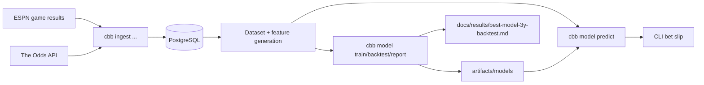

# Architecture

Canonical links:

- [Repository README](../README.md)
- [Model Documentation](model.md)
- [Current Best-Model Report](results/best-model-3y-backtest.md)

This document covers the durable engineering shape of the system. Current tuned
model settings and seasonal bankroll results live in the generated report, not
in the architecture doc.

## System Overview

This repository is a local-first data and modeling system for NCAA men's
basketball betting workflows. It has four major runtime layers:

- upstream data providers: ESPN for game results and The Odds API for current
  and historical betting markets
- local storage: PostgreSQL as the system of record
- local compute: a Python CLI that ingests data, trains models, runs backtests,
  and produces predictions
- local infrastructure: a `k3d` Kubernetes cluster that runs PostgreSQL and the
  chart's supporting services

Conceptually, the data flow is:

`ESPN / Odds API -> ingest -> PostgreSQL -> feature generation -> training or prediction -> artifacts or bet slip`

## Major Components

- Data ingestion: `src/cbb/ingest/` loads ESPN results, current odds, and
  historical closing odds, then normalizes them into the local schema.
- Database layer: `src/cbb/db.py` owns engine creation, schema initialization,
  and the high-level database workflows exposed by the CLI.
- Feature computation: `src/cbb/modeling/dataset.py`,
  `src/cbb/modeling/features.py`, and `src/cbb/modeling/ratings.py` convert
  stored games and odds snapshots into sequential training and prediction
  examples.
- Model training pipeline: `src/cbb/modeling/train.py` fits artifacts and saves
  them under `artifacts/models/`.
- Backtesting and policy: `src/cbb/modeling/backtest.py` and
  `src/cbb/modeling/policy.py` simulate walk-forward staking and apply bet
  selection thresholds.
- Prediction engine: `src/cbb/modeling/infer.py` loads artifacts, scores the
  live slate, and formats the ranked recommendations returned by the CLI.
- CLI interface: `src/cbb/cli.py` is the operational entry point for database,
  ingest, train, backtest, predict, audit, and backup commands.
- Helm chart: `chart/cbb-upsets/` defines the local Kubernetes deployment used
  for PostgreSQL and the chart's supporting service resources.

## Data Storage

PostgreSQL is the primary persistent store.

The main tables are:

- `teams`: canonical Division I team catalog
- `team_aliases`: provider-specific names mapped back to canonical teams
- `games`: normalized schedule and result rows, including scores and event IDs
- `odds_snapshots`: current and historical bookmaker snapshots for moneyline,
  spread, and totals markets
- `ingest_checkpoints`: historical game backfill checkpoints
- `historical_odds_checkpoints`: historical odds snapshot checkpoints

What is persisted:

- canonical team identity and aliases
- historical and upcoming games
- current odds captures
- historical closing-odds captures
- checkpoint state that makes ingest rerunnable

What is not stored in Postgres:

- trained model artifacts, which live as JSON files under `artifacts/models/`
- SQL backups, which live under `backups/`

## Kubernetes Architecture

Local development uses a `k3d` cluster created by `make k8s-up`.

The Helm chart currently deploys:

- PostgreSQL, enabled through the chart dependency and local values files
- a small NGINX deployment and service included in the chart templates

The important design point is that the main application logic does not run as an
in-cluster service today. Ingest, audit, training, backtesting, prediction, and
backup are run as local CLI jobs from the developer shell. The CLI talks to the
cluster-hosted database through `kubectl port-forward`.

That means the local development loop is:

1. start the `k3d` cluster
2. deploy the Helm release
3. forward PostgreSQL locally
4. run CLI jobs from the repo virtualenv

## Training Workflow

The training pipeline is intentionally straightforward:

1. load completed historical games and pregame odds from Postgres
2. rebuild rolling team state chronologically
3. generate side-based feature rows for the target market
4. fit the market model and calibration parameters
   The deployable spread path fits expected margin-versus-line, converts that
   estimate to cover probability, and then applies calibration.
5. write the artifact to `artifacts/models/`

For moneyline, the training path can also produce specialized price-band models
that are stored inside the artifact and used later by the dispatcher during
scoring.

## Prediction Workflow

Prediction runs from the same local CLI and uses the stored artifacts plus the
latest database state.

At a high level it does this:

1. load the requested artifact or artifacts from `artifacts/models/`
2. load completed games to rebuild current rolling team state
3. load upcoming games and the latest available odds snapshots
4. generate market-specific prediction examples
5. score those examples with the artifact
6. apply the active betting policy and bankroll limits
7. print a simplified bet slip

For the `best` strategy market, the current live path prefers spread when a
spread artifact is available. The prediction path also auto-derives the latest
walk-forward tuned spread policy unless that behavior is disabled from the CLI.
That tuning path is explicitly deployable: policies that place too few bets or
too little stake do not rank well merely by staying inactive.

## Artifact Management

Artifacts are stored as JSON files under `artifacts/models/`.

Each artifact contains:

- the market it was trained for
- the ordered feature list
- feature standardization parameters
- model weights and bias
- spread modeling mode and residual-scale parameters when the spread artifact
  uses margin-versus-market modeling
- calibration parameters
- training metrics
- moneyline dispatcher bands when present

Versioning is file-based. Running `cbb model train --artifact-name NAME` writes
`artifacts/models/<market>_NAME.json` and also refreshes the corresponding
`<market>_latest.json` file. The prediction command loads artifacts by market
and artifact name, so changing the active live model is a file-selection change,
not a database migration. Artifact loading is additive where practical: legacy
spread artifacts that do not yet store the mode or residual-scale fields still
load as classifier-style artifacts.
